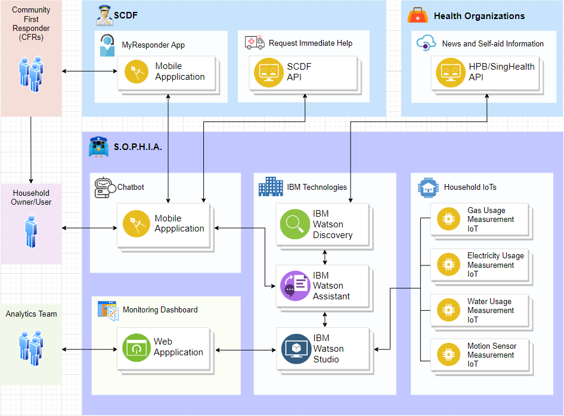

# Kerby-S.O.P.H.I.A._SCDFXIBM

Without reiterating too much of the short description, our team chose the problem statement titled: **Emergency Medical Services**. We have came up with a system (S.O.P.H.I.A.) where it enables real-time monitoring for early intervention measures. It is also connected to various applications from IBM technologies and relevant organizations like SCDF and other health organizations in Singapore. We understand that some of these connections or API endpoints are not available currently. For the sake of proof of concept, we will assume such technologies are present. Throughout this detailed description, we will explain the rationale behind each implementation. 

S.O.P.H.I.A. (Safety Officer Personalised Health Intelligence Assistant) is made up of three main layers:
1. Data Collection Layer
2. Data Consolidation and Cognitive Layer
3. Data Communication Layer

Analogous to the human body, the data collection layer serves as the sight and hearing function, the data consolidation and cognitive layer serves as the brain function and the data communication layer serves as the speech and movement actions. Here is a visual representation of the S.O.P.H.I.A. architecture.

## Seeing and Hearing (Data Collection Layer)

With the advent of IoTs, we are now able to collect real-time data. The main aim of collecting real-time data is to detect irregular behavior within the household. Apart from using IoTs to collect real-time data, we can also use a chatbot to collect more qualitative data. Using natural language processing, the chatbot will be able to perceive and bring attention to important words that can alert us a potentially irregular behavior.

Detecting irregular behavior presents us with an opportunity for early intervention. 

Let us illustrate with a simple example:

Regular Scenario: Person watches TV from 10am-12pm, 1pm-5pm and 7pm-9pm daily.  
Irregular Scenario: Person progressively watches lesser TV at the regular intervals. Other utilites usage like gas (cooking) has also seen a dip. Person remarked to the chatbot that they are always tired and have minor pains around the body for an extended period of time.

Possible Explanations:
1. Person is suffering from an onset of depression, with a increase in listlessness to carry out usual activities.
2. Person had a fall/injury, inhibiting the ability to perform usual activities.

In such cases, either the Community First Responders (CFRs), a family member or a professional officer can step in to properly assess the situation and provide mitigating remedies before a high-risk event occurs. This ensures that there will be potentially lesser high-risk event related calls to the SCDF and at the same time protects the well-being of the home owner.

### Points of data collection

There are three main categories of points of data collection:
1. Utilities (IoT, quantitative data)
2. Kitchen Activity (IoT, quantitative data)
3. User Responses (Chatbot, qualitative data)

#### Utilities

Under the Utilities category, we will be observing and measuring Electricity, Gas and Water usage through IoTs. In fact, the option to have such measurements using a "smart meter" taken already exist in the market. (See: https://www.ema.gov.sg/Metering_Options.aspx) 

Ideally, we would want to have IoTs that can measure usage from different appliances around the house for a more accurate representation of a typical behavior.

#### Kitchen Activity

Under the Kitchen Activity scategory, we will be observing and measuring Kitchen Activity through a Motion Sensor IoT. This is relevant because it help prevent fires related disasters in the household kitchen. The motion activity is to be used in tandem with the Gas usage data. 

If the gas is being utilized for 'x' amount of time and the motion sensor did not sense any movement in 'y' amount of time since the start of the gas usage, then an alarm will be triggered via IBM Watson Studio. This alarm will be sent to the chatbot via IBM Watson Assistant to alert the homeowner.

#### User Responses via Chatbot

## Understanding and Acting (Data Consolidation and Cognitive Layer)

With the advent of IoTs, we are now able to collect real-time data. The main aim of collecting real-time data is to detect irregular behavior within the household. Detecting irregular behavior presents us with an opportunity for early intervention. 

Let us illustrate with a simple example:

Regular Scenario: Person watches TV from 10am-12pm, 1pm-5pm and 7pm-9pm daily.  
Irregular Scenario: Person progressively watches lesser TV at the regular intervals. Other utilites usage like gas (cooking) has also seen a dip.

Possible Explanations:
1. Person is suffering from an onset of depression, with a increase in listlessness to carry out usual activities.
2. Person had a fall/injury, inhibiting the ability to perform usual activities.

In such cases, either the Community First Responders (CFRs), a family member or a professional officer can step in to properly assess the situation and provide mitigating remedies before a high-risk event occurs. This ensures that there will be potentially lesser high-risk event related calls to the SCDF and at the same time protects the well-being of the home owner.

### Points of data collection

As shown in the architecture, there are 4 points of data collection. They can be further classified into "Utilities" and "Kitchen Activity". 

#### Utilities

Under the Utilities category, we will be observing and measuring Electricity, Gas and Water usage through IoTs. In fact, the option to have such measurements using a "smart meter" taken already exist in the market. (See: https://www.ema.gov.sg/Metering_Options.aspx) 

Ideally, we would want to have IoTs that can measure usage from different appliances around the house for a more accurate representation of a typical behavior.

#### Kitchen Activity

Under the Kitchen Activity category, we will be observing and measuring Kitchen Activity through a Motion Sensor IoT. This is relevant because it help prevent fires related disasters in the household kitchen. The motion activity is to be used in tandem with the Gas usage data. 

If the gas is being utilized for 'x' amount of time and the motion sensor did not sense any movement in 'y' amount of time since the start of the gas usage, then an alarm will be triggered via IBM Watson Studio. This alarm will be sent to the chatbot via IBM Watson Assistant to alert the homeowner.

Nullam nec lectus massa. Proin feugiat placerat nisi lacinia lobortis. Duis efficitur ac orci ac lobortis.

## Conclusion

Lorem ipsum dolor sit amet, consectetur adipiscing elit. Nunc lacinia nisi ut fringilla sodales. Etiam elementum a arcu vel fringilla. Nulla ac efficitur felis. In a nisi bibendum, efficitur felis vel, consectetur quam. Aenean ornare justo velit, sed malesuada massa efficitur ut. Sed non augue vel risus tempus lacinia ac nec est. Nunc vel finibus felis. Vivamus felis diam, porta sed rhoncus eu, luctus eget justo. 

### Results

Nullam nec lectus massa. Proin feugiat placerat nisi lacinia lobortis. Duis efficitur ac orci ac lobortis.

## Acknowledgments

Nullam nec lectus massa. Proin feugiat placerat nisi lacinia lobortis. Duis efficitur ac orci ac lobortis.
