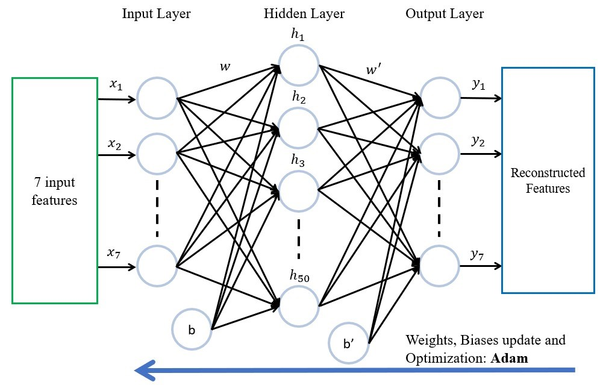
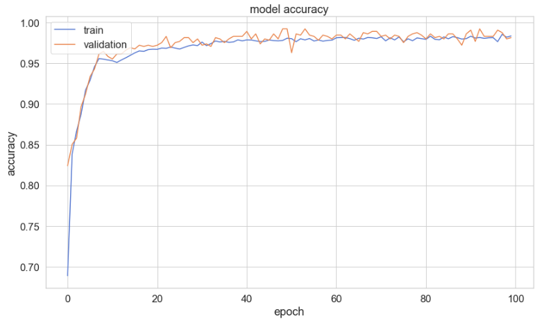
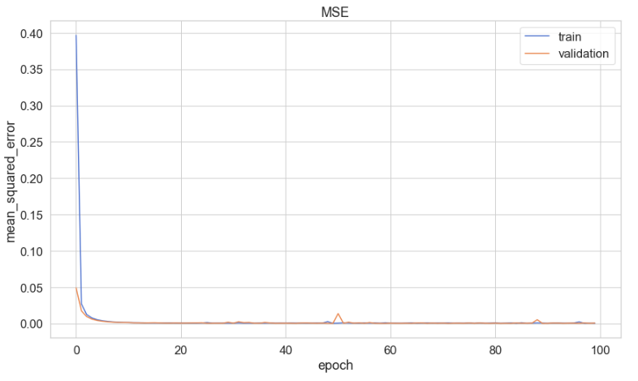

# Kerby-S.O.P.H.I.A._SCDFXIBM

Without reiterating too much of the short description, our team chose the problem statement titled: **Emergency Medical Services**. We have came up with a system (S.O.P.H.I.A.) where it enables real-time monitoring for early intervention measures. It is also connected to various applications from IBM technologies and relevant organizations like SCDF and other health organizations in Singapore. We understand that some of these connections or API endpoints are not available currently. For the sake of proof of concept, we will assume such technologies are present. Throughout this detailed description, we will explain the rationale behind each implementation. 

S.O.P.H.I.A. (Safety Officer Personalised Health Intelligence Assistant) is made up of three main layers:
1. Data Collection Layer
2. Data Consolidation and Cognitive Layer
3. Data Communication Layer

Analogous to the human body, the data collection layer serves as the sight and hearing function, the data consolidation and cognitive layer serves as the brain function and the data communication layer serves as the speech and movement actions. Here is a visual representation of the S.O.P.H.I.A. architecture.

## Seeing and Hearing (Data Collection Layer)

With the advent of IoTs, we are now able to collect real-time data. The main aim of collecting real-time data is to detect irregular behavior within the household. Apart from using IoTs to collect real-time data, we can also use a chatbot to collect more qualitative data. Using natural language processing, the chatbot will be able to perceive and bring attention to important words that can alert us a potentially irregular behavior.

Detecting irregular behavior presents us with an opportunity for early intervention. 

Let us illustrate with a simple example:

Regular Scenario: Person watches TV from 10am-12pm, 1pm-5pm and 7pm-9pm daily.  
Irregular Scenario: Person progressively watches lesser TV at the regular intervals. Other utilites usage like gas (cooking) has also seen a dip. Person remarked to the chatbot that they are always tired and have minor pains around the body for an extended period of time.

Possible Explanations:
1. Person is suffering from an onset of depression, with a increase in listlessness to carry out usual activities.
2. Person had a fall/injury, inhibiting the ability to perform usual activities.

In such cases, either the Community First Responders (CFRs), a family member or a professional officer can step in to properly assess the situation and provide mitigating remedies before a high-risk event occurs. This ensures that there will be potentially lesser high-risk event related calls to the SCDF and at the same time protects the well-being of the home owner.

### Points of data collection

There are three main categories of points of data collection:
1. Utilities (IoT, quantitative data)
2. Kitchen Activity (IoT, quantitative data)
3. User Responses (Chatbot, qualitative data)

#### Utilities

Under the Utilities category, we will be observing and measuring Electricity, Gas and Water usage through IoTs. In fact, the option to have such measurements using a "smart meter" taken already exist in the market.  
(See: https://www.ema.gov.sg/Metering_Options.aspx)  

  
(Credit: https://www.straitstimes.com/singapore/300000-smart-water-meters-to-be-installed-in-homes-firms)

Ideally, we would want to have IoTs that can measure usage from different appliances around the house for a more accurate representation of a typical behavior.

#### Kitchen Activity

Under the Kitchen Activity scategory, we will be observing and measuring Kitchen Activity through a Motion Sensor IoT. This is relevant because it help prevent fires related disasters in the household kitchen. The motion activity is to be used in tandem with the Gas usage data. 

If the gas is being utilized for 'x' amount of time and the motion sensor did not sense any movement in 'y' amount of time since the start of the gas usage, then an alarm will be triggered via IBM Watson Studio. This alarm will be sent to the chatbot via IBM Watson Assistant to alert the user.

#### User Responses via Chatbot

The envisioned end product of S.O.P.H.I.A.'s chatbot would be one that is able to dive into a deep conversation with the user and entertain them. Instead of an interrogative chatbot that would seem cold and will not elicit any useful responses from the user.

Through daily conversations with the user, the user might have instances where they mentioned about incidents that happened within their household or their general mood. The chatbot then serves as a platform to obtain vital information for early intervention.

Otherwise, without a chatbot, the user (an elderly) might have not mentioned their ailments, injuries or incidents to anyone. They might view such occurences as minor but it may come to a point where a build up such incidents will lead to an eventual high-risk incident of which it might be too late to recover from.

## Understanding and Acting (Data Consolidation and Cognitive Layer)

This is where all the data from the various sources come together to be fed into the models implemented within IBM Watson Studio.

### Grand Architecture

lorem ipsum

Gas Usage Anomaly Detection Model
Electric Usage Anomaly Detection Model
Water Usage Anomaly Detection Model
Kitchen Fire Risk Detection Model
Chatbot's Comprehensive NLP Model
Threat Scoring Model

### Example of a Electric Usage Anomaly Detection Model

In this section we will discuss an example of a Neural Network using an AutoEncoder model to detect anomalies from Electricity Usage Data.

A machine learning algorithm on Watson Studio will receive the respective data collected from the respective IoT sensors via the IoT platform on IBM Cloud. The ML algorithm executes Anomaly Detection with respect to ‘healthy’ data of a normal / regular / day-day activities of the residents in a household. 
 
A baseline architecture of the ML algorithm has been built such that it performs with an accuracy of 98% regardless of the type input data (electricity, water, gas, motion). It was built based on the household power consumption dataset collected by UCI, Center of Machine Learning and Intelligent Systems [3].

The data is that of a one-minute sample over a period of almost 4 years. However, in view of a quick simulation of the proposed solution, only data spanning across 5 days was utilized. The 7 features used for constructing the model are as follows: 

1) Global_active_power (Household) 
2) Global_reactive power (Household) 
3) Voltage 
4) Global_intensity (Household) 
5) Sub_metering_1 (Kitchen)  
6) Sub_metering_2 (Laundry room) 
7) Sub_metering_3 (Electric water heater & air-con)

** The features are with respect to the household power consumption dataset from UCI. It was only used for simulation purposes in this case. In view of deployment with Singapore households, the respective data will need to be collected from the relevant authorities. As such, number of features may vary as per the availability of data.

The architecture, known as an Autoencoder, is as follows:

The aim of the AE is to reproduce the same input data as the output and calculate the respective cost function. Therefore, it will only be trained on the ‘healthy’ (normal/ regular/ day-day) activities of the household such as electricity usage, water usage, gas usage and motion within the house. 

The accuracy of the model trained with electricity consumption data after 100 epochs is shown as follows:

A threshold is built based of the mean squared error (MSE) produced from training the AE with only the data of ‘healthy’ (normal/ regular/day-to-day) activities. 

 
Any deviation from the threshold indicates an anomalous activity. The activity can be a spike in electricity usage which might indicate the onset of a potential circuitry damage and fire or it can be a prolonged usage of gas which might indicate that it was left unattended for long.

## Communicating (Data Communication Layer)

### Chatbot

## Services Overview

## Conclusion 

### Future Work

